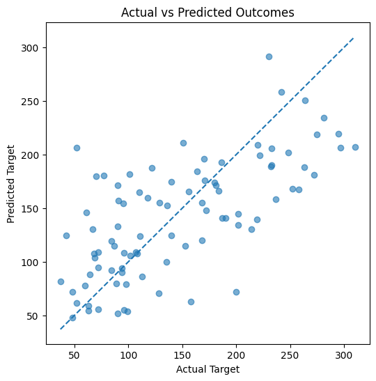

## 📊 Predictive Analytics: Diabetes Progression

### 📌 Project Overview
This project applies regression-based predictive analytics to analyze clinical factors associated with diabetes disease progression.  
The objective is to build an interpretable model that quantifies relationships between multiple health indicators and patient outcomes, with an emphasis on explainability and real-world relevance.

---

### 🧠 Methodology
- **Dataset:** Scikit-learn Diabetes dataset (442 samples, 10 clinical features)
- Conducted data inspection and quality checks (no missing values)
- Performed a train-test split to evaluate generalization performance
- Selected **linear regression** for interpretability and statistical transparency
- Evaluated model performance using **RMSE** and **R²**

---

### 📈 Results
- **R²:** 0.45 on test data  
- **RMSE:** ~53.9  
- The model captures meaningful relationships between clinical variables and diabetes progression while acknowledging inherent real-world variability.

---

### 🔍 Key Insights
- Several predictors show strong positive or negative associations with disease progression
- Coefficient analysis allows direct interpretation of how individual clinical factors influence outcomes
- The project prioritizes explainability over black-box accuracy, making results suitable for decision support

---

### 🛠 Tools & Technologies
- **Python**
- pandas, numpy
- scikit-learn
- matplotlib

---

### 🚀 Next Steps
- Apply regularization techniques (Ridge / Lasso) to improve generalization
- Explore non-linear models for comparison
- Perform feature engineering to enhance predictive performance

### 📁 Repository Structure

